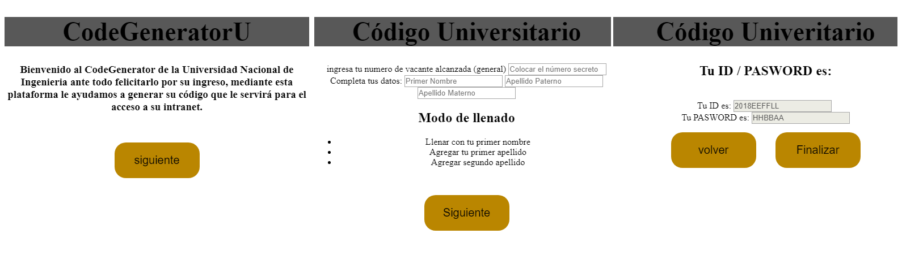
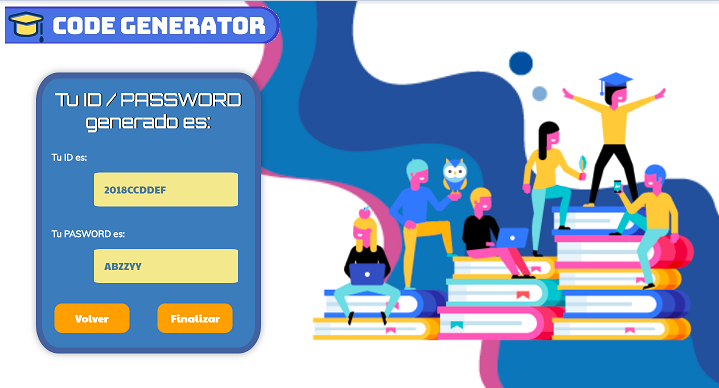

# CODE GENERATOR: Generador de Código
***

# Definición de la Aplicación
Bienvenidx a CodeGenerator

## Resumen del Proyecto
**Code Generator** es una aplicación web para poder generar el código de acceso a la intranet tan solo con tus datos.
Dirigida a las personas que recién ingresan a la universidad e institutos y deseen acceder a la plataforma de su institución para poder chequear sus notas, matriculas, horarios y Libros digitales.

La dinámica de esta aplicación hace que el usuario pueda generar su propio código para acceder a la plataforma de su institución, llenando tan solo sus datos como: puesto de ingreso, nombres, apellido materno y paterno (campos de llenado)

Esta aplicación ofrece un cifrado tipo César, donde se sustituye una letra de alfabeto por otra que se encuentra a cierto número de posiciones o desplazamiento en el mismo alfabeto. Además, solo tomamos las 2 primeras letras de cada campo y de esa forma generamos tanto el ID como el PASSWORD para su ingreso a la plataforma de cada institución.

## ¿Quiénes son los principales usuarios?
Todos los que acaban de ingresar a una Universidad e Institutos, y deseen ingresar a la intranet por defecto. También las mismas Universidades e Institutos.

## ¿Cuáles son los objetivos de estos usuarios en relación a tu producto?
El objetivo principal es ayudar a los usuarios a generar su propio código por defecto sin tener que trasladarse o movilizarse, todo mediante una aplicación web; para así poder facilitar el ingreso a la plataforma intranet de su institución, pudiendo así realizar su matrícula, visualizar horarios, cursos y conseguir recursos como libros digitales.

## ¿Cómo crees que el producto que estás creando está resolviendo sus problemas?
Hasta el día de hoy uno tiene que acercarse a su institución para que le puedan otorgarle el código de ID y Password de la plataforma intranet, siendo muy incómodo para los alumnos, puesto que siempre en la época de inicio de semestre se hacen largas colas para esto, y las personas que olvidan de llevar alguna identificación consigo tienen que volver otro día.
El problema principal radica en la movilización innecesaria para los usuarios.
CodeGenerator simplifica esta acción, ya que puedes hacer todo esto de manera directa a través de nuestra aplicación web de forma sencilla sin necesidad de movilizarte ni hacer grandes colas o tal vez perdiendo aquel papelito donde anotaron tu código!! OMG! Es por eso que se logra radicar el problema poniéndonos del lado del usuario.

## Decisiones de diseño que se tomaron:
Al tener definido a que tipos de usuario iba a estar dirigido este proyecto, se optó por crear una estructura sencilla, dinámica y visualmente atractiva; fácil de manejar, que permita una fluidez en su funcionamiento, así como en el entendimiento de los pasos a seguir.

Para poder ejecutar todo se consideró en usar 3 secciones donde el usuario pueda visualizar en primera instancia la página de inicio y una pequeña descripción, en la segunda página se puede visualizar el uso de un formulario(cajas con bordes redondeados, tamaño compacto , y todo debidamente proporcionado), en la página 3 visualizarán lo que viene a ser el resultado del cifrado y descifrado dando a conocer su código ID y PASSWORD en cajas como al igual que las secciones de la página 2 de forma estilizada.

****INCLUIR IMAGEN DE LAS 3 SECCIONES****

Con respecto a la elección de colores, se investigó sobre la psicología del color en relación a los usuarios y se optó por colores principales al azul y degradados ya que se caracterizan por la: concentración, simpatía, confianza y practicidad); además también se optó como principal al naranja porque transmite dinamismo, espontaneidad, alegría y jala a la visualización. Como color neutral se usó el blanco y los colores secundarios (especialmente para el fondo) fueron el lila, violeta y verde agua.

Para la creación del logotipo, se hizo de manera sencilla y sin rodeos, se aplicó el nombre del proyecto y los colores principales.

*** IMAGEN DEL LOGOTIPO ***

Sobre la fuente usada, se optó por manejar formas tipo sans-serif (transmite alegría y en ciertas ocasiones minimalismo), Orbitron (transmite seguridad), Muli (transmiten modernidad) y Paytone (aporta personalidad). Sobre el lenguaje de la aplicación, se hizo uso del lenguaje formal.

## ¿Cuál fue tu proceso para definir el producto final a nivel de experiencia y de interfaz?

Para este proyecto tuvimos 2 sprint, de los cuales mi aplicación fue cambiando.

>### Primer Sprint:

En mi primer sprint ya se tenía claro hacia qué público objetivo se dirigía, pero aún no se comprendía muy bien sus necesidades. Quería que mi plataforma tenga la misma funcionalidad de emitir el ID y Password pero que el desplazamiento se lo indique la institución por medio de un correo (aplicando así el mismo desplazamiento para el cifrado y descifrado).
Quería que cifrara su nombre y apellido tan solo cogiendo las 2 primeras letras de ambos campos. Para el Password pensaba en que el usuario recibiría por medio de un correo el texto a descifrar usando el mismo desplazamiento que para el ID.
Comencé trabajando con el HTML (estructura básica), luego practicando con cifrado y descifrado aparte; una vez que tenía eso, comencé a unirlo a mi código aplicando las funciones y trabando el JS con DOM’s.
Mi CSS era super básico, y aún no me quedaba clara la idea de cómo iba a obtener el usuario los códigos a descifrar y el desplazamiento, haciendo mi app muy compleja para el usuario.

>### Segundo Sprint:

Para este segundo sprint comencé a ahondar y pensar más en los usuarios (ponerme en sus zapatos) y en las necesidades que mi producto pudiera absolver (la problemática de cómo se genera y obtiene hoy en día un código para la plataforma intranet de cada instituto o Universidad).

Teniendo en cuenta muchos factores, reestructure todo el código, modifique el HTML y el JS. Logré adaptarme al usuario y construir una aplicación rápida en funcionalidad, donde el usuario pueda interactuar y completar los campos requeridos sin complicaciones.

Como último punto se tomaron nuevas decisiones respecto al diseño: nuevos colores, emplazamiento y formas, así como la adición de interacción y atractivo visual.

***

## Instrucciones y Funcionalidad de la aplicación.

> #### INSTRUCCIONES:

1. Al comienzo te aparecerá una pequeña descripción acerca de la aplicación web:
    - Haz click en el botón comenzar, para iniciar.
    - Para cifrar: Elige un número secreto que será el código de descifrado que utilizarás en adelante.
    - Para descifrar: Asegúrate de tener el número o código único de descifrado que te han proporcionado.
2. Llena los campos requeridos con tus datos reales.
    - Completa el campo que requiere tu puesto de ingreso (este será el numero para cifrar y descifrar)
    - Completa los siguientes campos con tu Nombre y tus Apellidos correspondientemente.
3. Hazle 'click' al botón `siguiente` para obtener tu ID y PASSWORD.
4. Listo! habrás conseguido tu **ID** (**cifrando** las 2 primeras letras de cada campo utilizando tu número de ingreso como el desplazamiento) y **PASSWORD** (al igual que en el ID tomamos las 2 primeras letras de cada campo, pero en este caso las **desciframos** y se devuelve en el orden inverso).

No necesita instalación,solo tendrá que dirigirse al siguiente enlace [Code Generator](https://cinthiavilcachagua.github.io/lim-2018-11-bc-core-am-cipher/src/)

Creado por Cinthia Vilcachagua.

